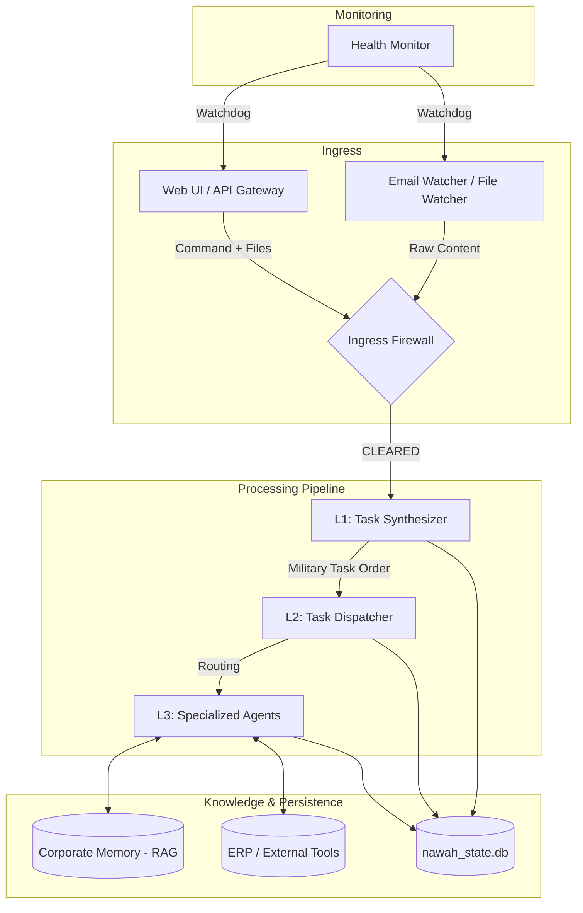

# Nawah Project: Technical Analysis and Documentation

This document provides a comprehensive overview of the **Nawah Project**, an enterprise-grade AI automation system ("Nawah OS").

## 1. System Architecture Overview

The system is designed as a multi-layered, agentic "Operating System" that handles incoming tasks from various sources (Web, Email, Local Folders) through a structured pipeline.

### High-Level Architecture Diagram


---

## 2. Core Components

### 2.1 Orchestration (`nawah_os.py`)
The master entry point that manages the lifecycle of all system daemons.
- **Service Management**: Uses a watchdog loop to monitor and auto-restart services.
- **Graceful Shutdown**: Ensures all agent memories are flushed and database checkpoints are performed before exit.
- **Pre-flight Checks**: Verifies environment health before launching.

### 2.2 API Gateway (`core/api_gateway.py`)
A FastAPI-based central nervous system.
- **Unified Endpoint**: `/api/command` handles fused text and file inputs.
- **Frontend Serving**: Hosts the React-based SPA from `web_root/`.
- **Stat Engine**: Provides real-time visibility into the task queue and filesystem state.

### 2.3 Task Synthesizer (L1) (`core/synthesizer.py`)
The first layer of AI intelligence.
- **Triage**: Uses Gemini (with Pydantic validation) to classify intent, priority, and complexity.
- **MTO Generation**: Produces a "Military Task Order" (MTO) — a structured JSON payload that defines the mission.
- **Failover**: Implements an `LLMFailoverRouter` to switch between API keys or models if failures occur.

### 2.4 Dispatcher (L2) (`core/dispatcher.py`)
The routing engine.
- **Agent Registry**: Maps task intents to specific agent classes.
- **Layered Execution**: Distinguishes between L2 (Task Fleet) and L3 (Executive Swarm) agents.

---

## 3. Advanced Agent Framework (`core/base_agent.py`)

Every agent in Nawah is built on a sophisticated meta-cognition framework:

| Feature | Description |
| :--- | :--- |
| **ReAct Loop** | Reason → Act → Observe cycle to ensure logical consistency. |
| **Tree of Thoughts** | Explores multiple decision paths and selects the one with zero governance violations. |
| **Self-Reflection** | Automatically corrects outputs when flagged by the Compliance Guardrail. |
| **Episodic Memory** | Agents "remember" past mistakes and successes via the RAG engine. |

---

## 4. Specialized Agent Swarm (`core/agents/`)

The system features a vast fleet of specialized agents:
- **Executive Swarm (L3)**: HR, Legal, Finance, Supply Chain, CRM, Negotiator. These agents integrate with institutional policies and ERP tools.
- **Task Fleet (L2)**: Vision, Analyst, Math, Translator, Code, Researcher, Report.

---

## 5. Security and Governance

- **Ingress Firewall**: Scans all incoming files for malware or policy violations.
- **Governance Engine**: Enforces corporate rules on agent decisions before they are finalized.
- **Quarantine**: Automatically isolates suspicious files in `nawah_quarantine`.

---

## 6. Directory Structure

```text
/
├── agents/             # Legacy/Template agents
├── core/               # System heart (FastAPI, Pipeline, Memory)
│   ├── agents/         # Live L2/L3 Agents
│   ├── memory/         # RAG and Shared Memory logic
│   └── tools/          # ERP and Sourcing tools
├── nawah_inbox/        # Incoming raw data
├── nawah_outbox/        # Analyzed Task Orders (JSON)
├── nawah_processed/    # Successfully completed tasks
├── nawah_logs/         # System logs and state backups
├── web_root/           # Frontend SPA (React/Vite)
└── nawah_os.py         # Main Orchestrator
```

## 7. Operational Workflow (The "Life of a Task")

1. **Reception**: A user uploads a file and an instruction via the Web Portal.
2. **Security**: The `api_gateway` sends the file to the `ingress_firewall`.
3. **L1 Triage**: The `synthesizer` analyzes the request and creates a Task Order.
4. **L2 Routing**: The `dispatcher` identifies the `legal_agent` as the best candidate.
5. **L3 Execution**: The `legal_agent` retrieves past precedents from `Corporate Memory`, reasons through the task, and generates a compliant response.
6. **Completion**: The result is saved to the DB and served back to the UI.
